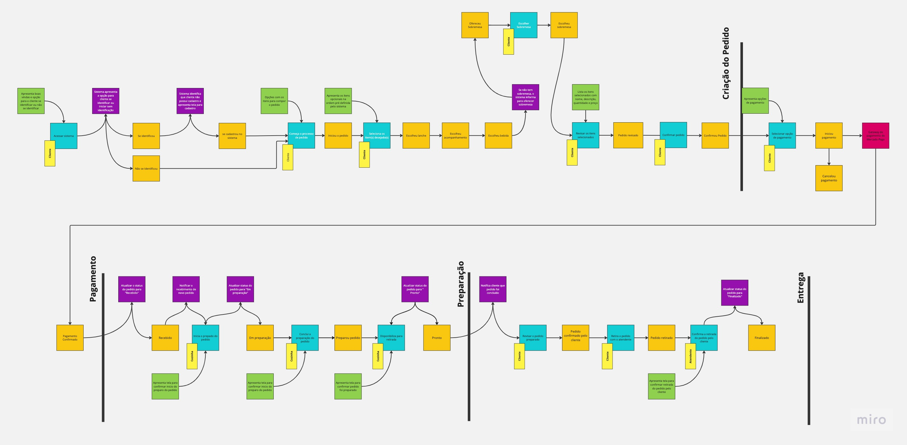
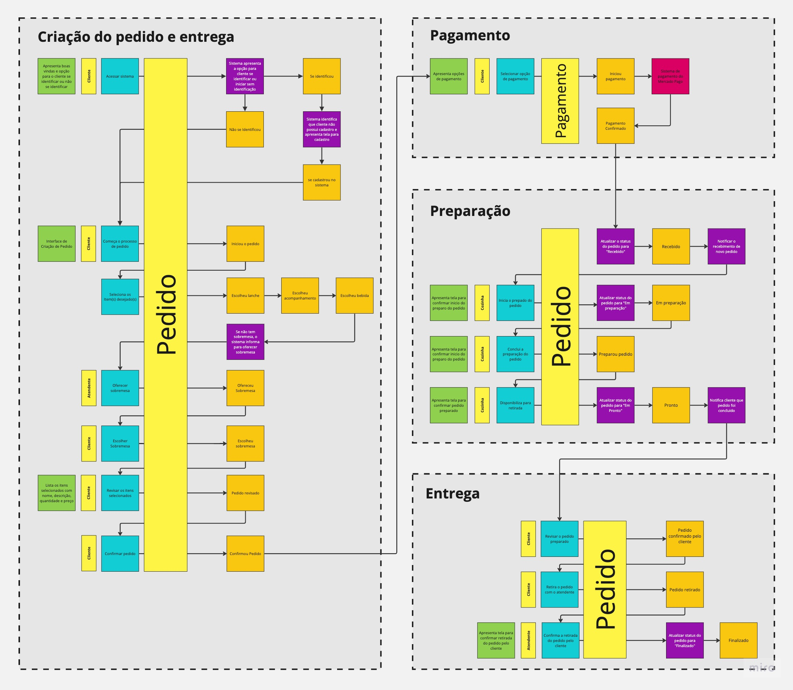

## FIAP PosTech Software Architecture - Modulo 1

Projeto do tech challenge para avaliação do módulo 1 do curso Software Architecture. Este projeto contém as seguintes implementações:
1. Documentação do sistema (DDD) utilizando a linguagem Úbiqua;
1. Api backend para o sistema;
1. Dockerfile e Docker Compose para execução da aplicação com banco de dados.

### 1 - Documentação do sistema (DDD) utilizando a linguagem Úbiqua;

Para demonstrar o processo implementado pela api backend foram modelados os seguintes processo:

### 2 - Api backend para o sistema;

Para a implementação da api backend contendo os endpoints que representam o processo, foi utilizada a linguagem Java junto com o Framework Spring boot. Os pré requisitos para construir e executar a aplicação são os seguintes:

- Java 17
- Apache maven 3.8.2
- Docker 

Para construir a aplicação basta, partir do diretório raiz do projeto, executar o seguinte comando maven no terminal:
`mvn clean package`

### 3 - Dockerfile e Docker Compose para execução da aplicação com banco de dados.

Com o build da aplicação backend concluído, as etapas para construção da imagem e execução do docker compose podem ser executados com os seguintes comandos a partir da raiz do projeto: 

- Comando do docker para construir a imagem da aplicação
  `docker build -t postech-soat-modulo-1 .`
- Comando do docker compose responsável por iniciar as imagens da aplicação backend junto da imagem do postgresql, que será utilizado como banco de dados. `docker-compose -f ./docker/docker-compose.yml up`

## Acesso a documentação da api (Swagger)

Com a aplicação e o banco de dados iniciados, podemos acessar a documentação da api a partir do endereço ***[http://localhost:8080/swagger-ui/index.html](http://localhost:8080/swagger-ui/index.html)***

